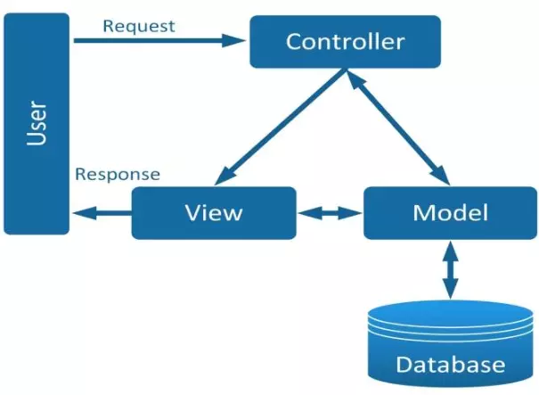

# Web-NANGCAO
Bài giữa kì

<p align="center"><a href="https://laravel.com" target="_blank"></a></p>

<p align="center">
<a href="https://github.com/laravel/framework/actions"></a>
<a href="https://packagist.org/packages/laravel/framework"></a>
<a href="https://packagist.org/packages/laravel/framework"></a>
<a href="https://packagist.org/packages/laravel/framework"></a>
</p>


## 🛍️ Shop Mini - Laravel E-Commerce Website

> Một dự án web bán hàng mini được xây dựng bằng **Laravel**, mô phỏng giao diện và trải nghiệm của trang **Adidas Vietnam**, với mục tiêu giúp sinh viên thực hành lập trình web hiện đại, MVC, Blade template, và kết nối cơ sở dữ liệu MySQL.

---

## Giới thiệu

**Shop Mini** là một website thương mại điện tử mô phỏng cửa hàng thể thao trực tuyến (E-Store), nơi người dùng có thể xem sản phẩm, xem danh mục (Nam, Nữ, Trẻ em, Thể thao, Sale...), tìm kiếm, và quản lý giỏ hàng.

Website được phát triển dựa trên **Laravel Framework** kết hợp **Blade Template**, **TailwindCSS** và **MySQL**.

---

##  Công nghệ sử dụng

| Thành phần | Mô tả |
|-------------|-------|
| **Laravel 12.x** | Framework chính theo mô hình MVC |
| **PHP 8.3+** | Ngôn ngữ backend |
| **MySQL / MariaDB** | Cơ sở dữ liệu lưu trữ sản phẩm & người dùng |
| **Blade Template** | Template engine tích hợp của Laravel |
| **TailwindCSS** | Thiết kế giao diện gọn nhẹ, hiện đại |
| **Vite** | Dùng để build CSS và JS (vite.config.js) |


---

## Mô hình MVC :



---

## 🧩 Cài đặt & Chạy dự án

### 1. Clone project
```bash
git clone https://github.com/phamngocvu-pka/Web-NANGCAO
cd Shop-mini

```

### 2.Cài môi trường:
```
cp .env.example .env
php artisan key:generate 
```
## 3. Chạy :
```
php artisan serve
```